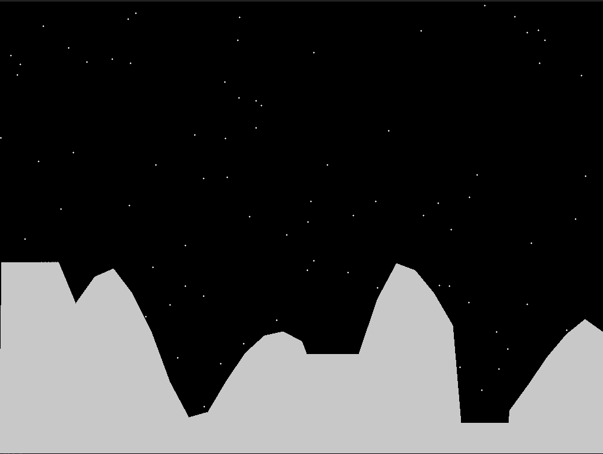
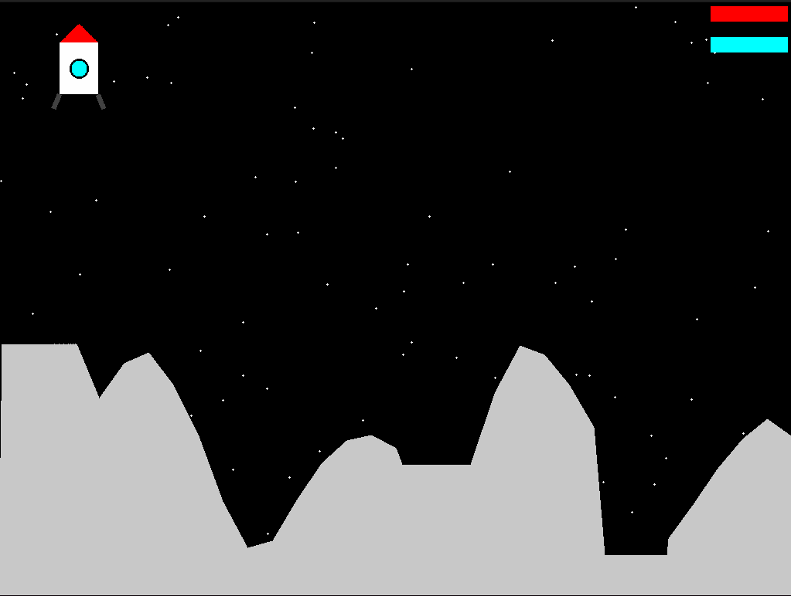
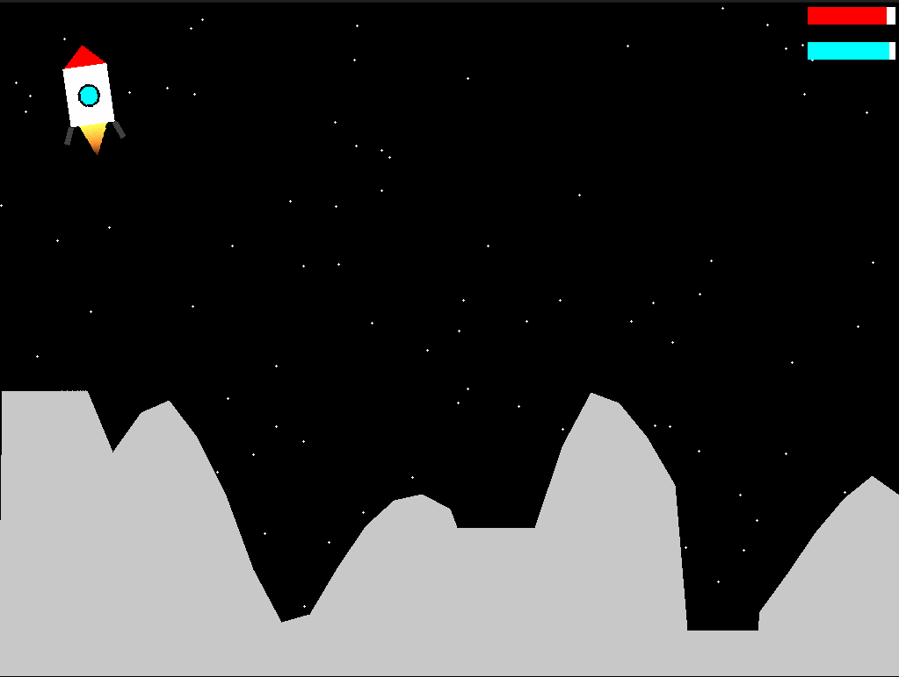
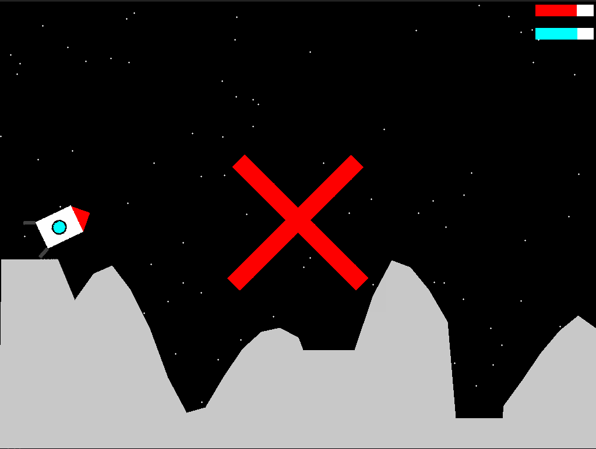
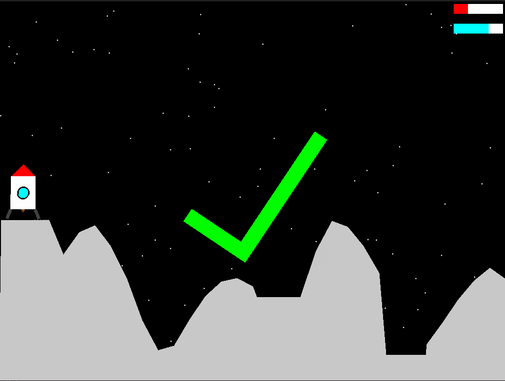
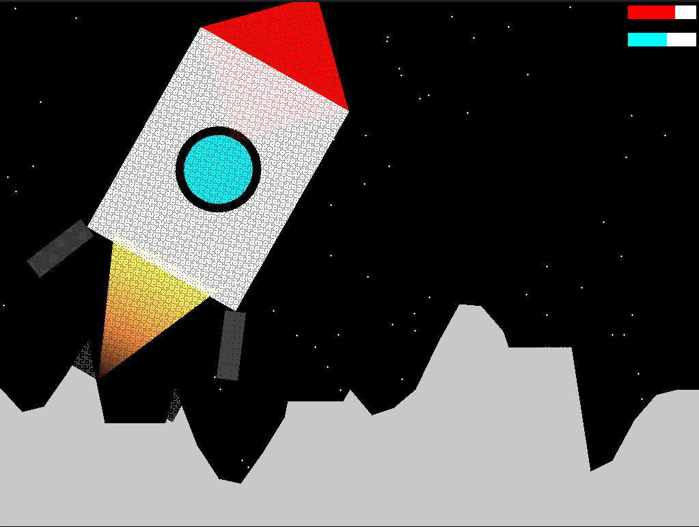
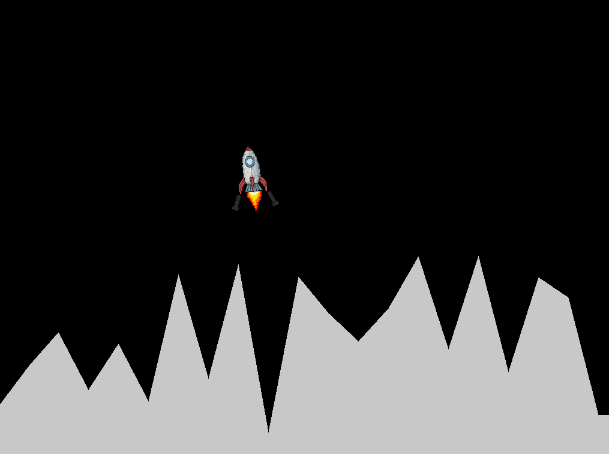

# Lunar Lander

## Введение

Lunar Lander - аркадная игра, цель которой - управлять посадочным лунным модулем, чтобы произвести мягкую посадку на поверхность Луны.

Данная реализация этой игры предоставляет возможность попробовать себя в роли пилота ракеты, у которой вот-вот закончится топливо, и единственная задача спастись - мягкая (предупреждаю - очень мягкая) посадка на поверхность луны.

Благодаря идеальной работе диспетчеров с Земли, удалось найти место, на которое можно безопасно посадить ракету. Однако самое трудное - только впереди.

## Геймплей

Игрок появляется над поверхностью луны, которая генерируется автоматически. В выбранном месте есть как минимум три ровных площадки, на которые можно посадить ракету (если повезёт, можно найти и больше безопасных мест, однако стоит остерегаться наклонных поверхностей при поиске).

Управляя ракетой (подробнее об этом в разделе [Управление](#управление)), игрок должен посадить ракету до того, как закончится топливо. Индикаторы топлива и монотоплива (необходимо для вращения ракеты) находятся в правом верхнем углу экрана и обозначены красным и бирюзовым цветом соответственно.

Главные секреты правильной посадки - очень низкая скорость, касание обеими посадочными опорами и не наклоненная поверхность.

## Управление

Игрок управляет ракетой, используя клавиши `Arrow Up` и `Arrow Down` для увеличения и уменьшения тяги, `Arrow Left` и `Arrow Right` для регулировки угла наклона ракеты. Также в игре присутствует возможность включить автоматическую стабилизацию на клавишу `Enter`, которая будет тратить драгоценное монотопливо для уменьшения скорости вращения ракеты. Для выхода из игры следует использовать клавишу `Escape`

## Визуал

Ниже представлены некоторые визуальные части игры. Для большего ознакомления рекомендуется поиграть в игру самому.

Знакомьтесь, луна:


А вот, и Вы :


Давайте включим двигатели:


Если посмотреть в правый верхний угол, можно убедиться в ограниченности нашего запаса топлива.

Любой пилот проходил специальную подготовку на различных симуляторах. Поэтому каждый знает, что будет если просто отключить двигатель и попробовать упасть на луну. Наш пилот, конечно, такого не допустит, но давайте заглянем к нему в голову и узнаем, что такое настоящая жёсткая посадка на луну:



Ну теперь включим двигатели и посадим наш аппарат на ближайшее ровное место:



Уровень пройден. Теперь можно пробовать себя снова и снова на новых лунных ландшафтах.

## Описание кода

В данном разделе обсудим технические моменты игры. Будем ставить задачи и описывать их решение. Сразу стоит оговорить, что игра написана на основе предоставленного фреймворка `Engine.h`, `Engine.cpp`, который позволяет свести задачу отрисовки на экран к простому заполнения буфера заданного размера. Также этот фреймворк инкапсулирует обработку ивентов и многое другое.

### Отрисовка в буфер

В игре весь визуал можно разделить на три основных части:

- Игровые объекты (представляют собой прямоугольники)
- Планету (ландшафт и звёзды на фоне)
- Пользовательский интерфейс (шкалы топлива и монотоплива)

Шкалы топлива представляют из себя класс `ProgressBar`, который просто заполняет часть предоставленной ему области одним цветом, а оставшуюся часть - другим.
Первые два вида визуальной составляющей игры разберём подробнее:

#### Планета
Планета представляет из себя обёртку на классом `Landscape`, выполняя генерацию нового ландшафта и звёзд, а также их отрисовку.

Сам ландшафт представляет из себя набор точек, упорядоченных по первой координате. Высоты вне этих точек вычисляются с помощью линейной интерполяции (линейной в силу специфики обнаружения коллизий).

Ландшафт генерируется в два этапа:

- Генерируются три плоские области для посадки (каждая в своей части ландшафта)

```c++
static constexpr size_t Areas_count = 3;
static constexpr size_t Min_area_size = 80;
static constexpr size_t Max_area_size = 100;

std::array<uint32_t, Areas_count> area_positions;
std::array<uint32_t, Areas_count> area_sizes;
for (size_t i = 0; i < Areas_count; ++i)
{
    size_t left_border  = i * width_ / Areas_count;
    size_t right_border = left_border + width_ / Areas_count - 1;
    area_positions[i] = generate_rand_from_to(left_border, right_border - Min_area_size);
    area_sizes[i] = generate_rand_from_to(Min_area_size, std::min(right_border - area_positions[i], Max_area_size));

    uint32_t area_height = height_ - generate_rand_from_to(min_height, max_height);
    ground_.add_point(area_positions[i], area_height);
    ground_.add_point(area_positions[i] + area_sizes[i] - 1, area_height);
}
```

Далее, произвольно генерируются остальные точки (главное, чтобы новых точек не было в плоских областях, иначе они перестанут быть плоскими):

```c++
size_t cur_area = 0;
for (size_t x = 0; x <= width_; x += pixels_per_line)
{
    double part_of_width = static_cast<double>(x) / width_;
    double y_tmp = height_ - height_mean + height_std * 
            std::sin(part_of_width * 2 * M_PI) * 
            std::cos(x);

    size_t y = y_tmp + generate_rand_from_to(-static_cast<int32_t>(height_std) / 10, height_std / 10);

    if (cur_area < Areas_count && x > area_positions[cur_area] + area_sizes[cur_area])
        ++cur_area;

    if (cur_area >= Areas_count || x < area_positions[cur_area])
        ground_.add_point(x, y);
}
```

Отрисовка происходит обычным получением высоты ландшафта в каждом столбце:

```c++
for (size_t x = 0; x < width; ++x)
{
    size_t cur_height = std::min(static_cast<uint32_t>(height), ground_.get_height(x));
    for (size_t y = height - 1; y > cur_height; --y)
        buffer[y * width + x] = color_;
}
```

Функция `get_height` использует две точки, между которыми лежит интересующая нас координата и интерполирует высоту. Для оптимального получения высоты класс `Landscape` кеширует последние используемые точки, поэтому при вызове его от возрастающей последовательности `x` координат (без больших скачков) ближайшие опорные точки ландшафта даже не приходится искать.

#### Игровые объекты

Для отображения игровых объектов был реализован класс `Sprite`, который хранит в себе информацию о самой картинке (класс `RectTexture`) и о её местоположении на экране (класс `RectTransform`). Стоит обратить внимание, что класс `RectTransform` реализован не в виде матрицы, а просто хранит в себе позицию и поворот (а также опорную точку, относительно которой происходит вращение). Для ускорения работы значения `sin` и `cos` угла кешируются, что позволяет обращаться к ним сколько угодно раз.

Само отображение текстуры на экран (точнее заполнение буфера, предоставленного фреймворком) выглядит достаточно просто:

- Берём пиксель картинки
- Получаем позицию на экране
- Рисуем, если не за экраном

Однако на деле всё получилось не так просто. Вот пример того, как выглядит повёрнутая на 45 градусов картинка ракеты:



Не удивляйтесь размерам ракеты. Она была увеличена для большей наглядности. Как можно видеть, некоторые пиксели не отрисовываются корректно. Это происходит из-за целочисленности координат в буфере.

Для того, чтобы корректно и быстро заполнять пропущенные пиксели сначала использовалась функция, которая для конкретной координаты 
`(x, y)` берёт четыре пикселя `(x_floor, y_floor)`, `(x_floor, y_ceil)`, `(x_ceil, y_floor)` и `(x_ceil, y_ceil)`. По размеру дробной части определялся альфа канал соответствуюшего пикселя, и он рисовался в буфер, используя альфа-блендинг. После серии экспериментов выяснилось, что такой же результат даёт просто заполнение одного из соседних пикселей тем же цветом. Альфа блендинг в данном случае был заведомо не очень полезен в силу того, что он учитывает только один альфа канал (это было сделано специально для того, чтобы буффер, с которым мы блендили всегда имел нулевую прозрачность). В итоге было реализовано отображение картинки с заполнением одного соседнего пикселя (заполнение можно отключить, передав в конструктор `Sprite` флаг `expand = false`).

После реализации основного геймплея было решено использовать картинки вместо обычных геометрических примитивов (скажу сразу, от идеи отказался). Для этого была подключена библиотека OpenCV для загрузки картинок и преобразования их в формат `BGRA`, который используется в целевом буфере. Результаты можете наблюдать ниже:



Даже без ног, которые выглядят как два летающих фонарика, этот вариант показался мне некоторого рода набором графических фич, нежели полноценной игрой. Именно поэтому было принято итоговое решение использовать геометрические примитивы.

---

### Обнаружение и обработка коллизий

#### Обнаружение коллизий
Для обнаружения и обработки коллизий был написан абстрактный класс `Collider` и его конкретная реализация - `RectCollider`. Для того, чтобы каждый раз не вызывалась виртуальная функция, было принято решение использовать Axis-Aligned Bounding Box (далее, AABB). Теперь виртуальные функции вызываются только в том случае, когда есть пересечение с AABB. Каждый `Collider` должен реализовать функцию пересечения с остальными коллайдерами и отрезком (для столкновений с ландшафтом). Каждая такая функция проверки возвращает `std::pair<bool, Vector2d>` - индикатор, была ли коллизия и `mtv` - минимальный вектор, на который необходимо сместить один из объектов для устранения коллизии. В качестве метода обнаружения коллизии была выбрана _Теорема о разделяющей оси_. Она гласит, что два выпуклых многоугольника не пересекаются тогда и только тогда, когда существует ось, проекции на которую этих многоугольников также не пересекаются. Более того, несложно понять, что оси можно искать среди нормалей к сторонам многоугольников. И если такой оси нет, то `mtv` будет параллелен одной из осей. Выберем ось с наименьшим пересечением, откуда найдём mtv.

#### Обработка коллизий
Так как в игре пока есть только взаимодействие ракеты и ландшафта, то обработка присутствует только в виде реакции ракеты на массив структур типа `CollisionInfo`, в каждом элементе которого хранится нормаль к отрезку ландшафта и `mtv` из функции обнаружения. Не самым корректным с физической точки зрения образом находится точка `RectCollider`-а, к которой мы и прилагаем усилия по разрешению коллизии. Это допустимо для текущего состояния игры (после столкновения с землёй нет возможности продолжать играть на этой ракете на этой карте), однако для своего рода физических песочниц такой подход явно не подходит и в будущем стоит его переработать.

Дальнейшая обработка происходит в функции `Rocket::apply_collision_response`. Там всё относительно понятно. Единственное, что хотелось бы пояснить - это расчёт изменения угловой скорости. Дальше будут приведены некоторые физические факты, в которых, я надеюсь, я не ошибся.

Самое главное, что стоит учесть - крутим ракету мы относительно её центра масс, а в реальности вращение происходило бы относительно точки соприкосновения с поверхностью. Это стоит учитывать при дальнейших расчётах. Далее перепишу несколько формул из своей тетрадки:

$$\Delta w = \frac{r\times J}{I} = \frac{r\times \Delta v\cdot m}{I}$$
где $J$ - момент импульса, а $I$ - момент инерции.

Для нашего коллайдера (он прямоугольный) момент инерции относительно центра равен
$$I_{rect} = \frac{1}{12}m(a^2 + b^2) = \frac{m}{12}\|\text{rect.size}\|^2$$

Применяя несколько раз теорему о параллельных осях (теорема Штейнера):
$$I_{rect, center} = I_{rect} + md^2$$
где $d$ расстояние от центра фигуры до центра текущего коллайдера, получим тот результат, который реализован в коде. (Деление на количество коллизий нужно просто для усреднения действия множества отрезков, потому что для каждого из них `mtv` вычислялся независимо).

```c++
static constexpr int Inertia_factor = 3;
Vector2d rel_pos = most_remote_point - transform_.get_position();
double delta_rot_speed = -Inertia_factor * rel_pos.dot((delta_v - horizontal_velocity * friction_factor).normal());
delta_rot_speed /= rect_size.norm_sq() + Inertia_factor * (collider_position.norm_sq() + rel_pos.norm_sq());
delta_rot_speed /= number_of_collisions;
```

## Идеи по улучшению
Здесь оставлю свои идеи по развитию и улучшению проекта, которые приходили мне в голову в процессе написания игры, но не были реализованы в силу нехватки времени.

- Более адекватная система обработки коллизий
- Добавление некоторого шума в текстуру ландшафта
- Добавление динамических объектов на сцену
- Добавление уровней в открытом космосе (стыковка, прохождение полосы препятствий, уклонение от летящих метеоритов)
- Добавление разных планет со своими физическими особенностями.